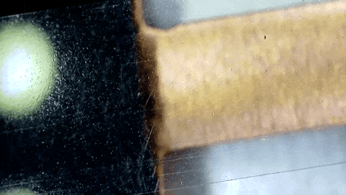

# SampleRecorder - A Cassette-based continous sample collection and acuisition tool

Welcome to the openUC2 Sample Recorder Hackathon! Our goal in this hackathon is to address the critical need for an open-source device that can continuously collect various types of microscopic samples. To achieve this, we aim to repurpose old audio cassettes and integrate them into our microscopes.

We already have a functional prototype that serves as a starting point for this project. However, we need to extend it with a UV curing assembly. This assembly will first apply UV nail polish to the cassette, which will then be cured using UV LEDs. The reason for using UV nail polish is that it is sticky enough to collect particles from the air, yet flexible enough to be rolled up once it has dried.

Our primary objective is to design the device in such a way that it can be easily attached to a bike. This will allow us to capture airborne microparticles as the bike is ridden through different environments. To facilitate this, we plan to incorporate GPS technology to track the location of particle collection. Additionally, we may explore integrating weather services to gather data on weather conditions during sampling.

This documentation serves as an overview of the continuous sample recorder project. It covers the motivation behind the project, outlines our specific goals, and provides background information on the existing prototype. By developing an open-source device that can continuously collect microscopic samples, we aim to contribute to scientific research and environmental monitoring efforts.

For more detailed information, including instructions, schematics, and code implementation, please refer to our project's GitHub repository. We encourage collaboration and welcome contributions from the community. Together, we can create an innovative solution that addresses the need for continuous sample collection and empowers researchers worldwide.

## Motivation

The motivation behind the continuous sample recorder project is to address the widespread presence of microplastics in various environments such as mountains, oceans, and even the air. Despite their prevalence, the sources and factors influencing microplastic concentrations remain unclear. In order to tackle this issue, it is important to analyze the air we breathe and understand the distribution and composition of microparticles. The project emphasizes the importance of community involvement to collectively contribute towards monitoring and studying microparticles. Furthermore, the project aims to leverage the abundance of audio cassettes for recycling purposes.

## Goal

The primary goal of the continuous sample recorder project is to develop a cassette-derived device capable of collecting airborne particles. The project draws inspiration from the Bike Particle Accelerator, a similar concept that focuses particles onto a slit before collection. The device will be designed to be mounted on a bicycle and will utilize a continuous airtrap with a sticky tape recorder. The tape will serve as a medium for collecting microparticles, which can later be analyzed using various techniques such as microscopy and spectroscopy.

To achieve the goals of the project, the following steps will be undertaken:

1. Develop a cassette-derived device: The device will be designed and constructed using a combination of cassette components and additional custom components necessary for particle collection and tracking.

2. Incorporate a particle focusing mechanism: Inspired by the Bike Particle Accelerator, the device will include a mechanism to focus particles onto a slit before they are collected. This will ensure efficient particle capture.

3. Track location and weather data: The device will integrate GPS coordinates to track the location of particle collection. Additionally, weather services may be incorporated to gather data related to weather conditions during sampling.

4. Implement a sticky tape recorder: The device will utilize a continuous tape recorder with a sticky surface to collect microparticles. A potential method for achieving stickiness is using UV-curable nail polish, which provides flexibility, stickiness, and transparency when dry.

5. Build a functional prototype: The project aims to build a functional demonstrator prototype that showcases the capabilities of the continuous sample recorder. This prototype can be used to validate the concept and gather feedback for further improvements.

## Background

The continuous sample recorder project is built upon an existing prototype that resembles an ESP32 controlling the 28byj-48 motor with the ULN2003 driver. This prototype serves as the foundation for the development of the cassette-derived device. Additionally, future plans involve integrating the device with a UC2 microscope or other standards such as wellplate formats to enhance its versatility and compatibility with different analysis techniques.

By leveraging the existing prototype and building upon it, the continuous sample recorder project aims to create a practical solution for monitoring and analyzing airborne microparticles. The project encourages collaboration and welcomes contributions from the community to collectively address the issue of microplastic pollution and its impact on the environment.

Please refer to the project's GitHub repository for more detailed information, including instructions, schematics, and code implementation. Feel free to contribute, provide feedback, and join the community effort to build a better understanding of microparticles and their distribution. Together, we can make a positive impact on environmental research and conservation.

## Current State: Building the Prototype

Transparent Tape under a microscope (Thoman)

Capturing particles trapped on a microscopy slide under a microscope

Trying to capture microplastic using  a crosspolarization microscopy scheme

Transparent cassette from Thoman

Current prototype based on an ESP32 with a 28byj stepper motor and a GPS module

The tape can be "played" in one directon only

Example UC2-based setup where the cassette can be adjust along one direction; Illumination and curing mechanism still missing

### Setting up and Adapting

### Optical Setup

### test Setup

### Code

#### ESP32

#### PYTHON

#### Image Processing

#### ImSwitch

### How to set up?

## Safety

## Challenge

### Varitions

## When Goal is met?

- PArticles can be trapped on the record
- tape is unrolled and rolled automatically
- timestamp is correlated with GPS Data
- A microscope captures the hole tape automatically
- The nailpolish is dispensed and cured autoamtically

## Ressources

## License
